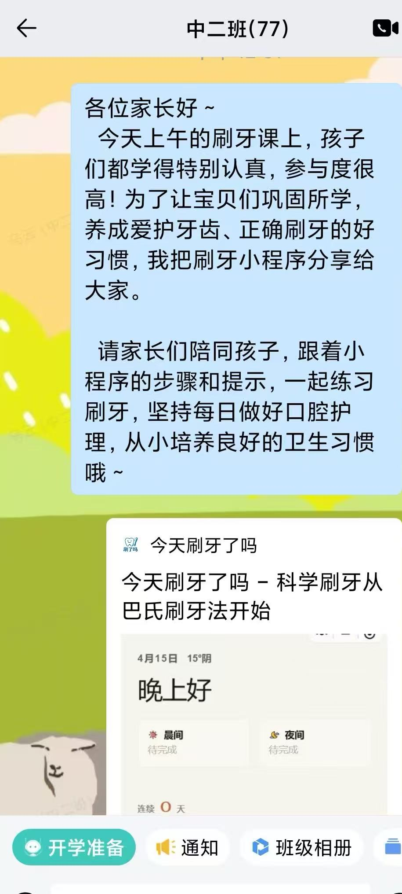

# Dentic - Did You Brush Today?

[](https://developers.weixin.qq.com/miniprogram/dev/framework/)
[](https://taro.zone/)
[](https://react.dev/)
[](https://www.typescriptlang.org/)
[](#license)

[中文](./README.md) | [English](./README.en.md)


A WeChat Mini Program based on the Bass brushing method, designed to guide scientific brushing habits, daily consistency, family collaboration, and leaderboard motivation.

## Mini Program QR Code


## Features

- **Guided Bass Brushing Flow**: 15-step guided brushing with countdown, step prompts, and completion feedback
- **Brushing Session State Machine**: idle / countdown / brushing / paused / completed states
- **Audio + Haptics + Wake Lock**: voice/step audio, vibration feedback, and keep-screen-on during brushing
- **Morning/Evening Tracking**: records by business date with separate morning and evening completion status
- **History Calendar & Stats**: monthly calendar, same-day morning/evening timestamps, streak/total days/month completion rate
- **Family Collaboration**: create family, invite/join flow, family dashboard, member status, interactions (encourage/remind)
- **Leaderboard**: switch between total days and streak ranking dimensions
- **Profile Center**: avatar/nickname authorization and sync, reminder/sound/voice toggles
- **Weather Widget**: local weather on home page with location permission and cache
- **Data Reliability**: startup local-to-cloud migration and retry queue for failed uploads
- **Share Capability**: share to contacts and Moments

## Pages & Routes

From `src/app.config.ts`:

- `pages/index/index`: brushing home
- `pages/history/index`: history and stats
- `pages/family/index`: family main (dashboard/members/interactions)
- `pages/family/create`: create family
- `pages/family/join`: join family
- `pages/rank/index`: leaderboard
- `pages/profile/index`: profile center (settings merged here)

## Tech Stack

| Area | Solution |
|------|------|
| Framework | Taro 4 + React 18 + TypeScript |
| State Management | Zustand (vanilla stores + persistence) |
| Build | Taro CLI + Vite Runner |
| Styling | Sass + Tailwind CSS |
| 3D Rendering | three-platformize (Three.js adapter for WeChat Mini Program) |
| Backend | WeChat Cloud Development (Cloud Functions + Cloud DB) |
| Code Quality | ESLint + TypeScript typecheck |

## Project Structure (Current)

```text
src/
├── pages/
│   ├── index/           # brushing home
│   ├── history/         # history and stats
│   ├── family/          # family (main/create/join)
│   ├── rank/            # leaderboard
│   └── profile/         # profile center (settings)
├── domains/
│   └── brush/
│       ├── hooks/       # brushing state/effect orchestration
│       ├── components/  # brushing UI states
│       ├── effects/     # audio/vibration/wake-lock adapters
│       └── repositories/# brushing data repository (save/sync)
├── components/          # page-level and shared UI components
├── stores/              # auth/profile/settings/family/records stores
├── services/
│   ├── api/             # cloud function invocation + domain APIs
│   ├── migration.ts     # local history to cloud migration
│   ├── syncQueue.ts     # failed upload retry queue
│   ├── weatherService.ts# weather service
│   └── ...
├── constants/           # brushing steps, weather mappings, etc.
└── assets/              # icons, audio, fonts, etc.

cloud/functions/
├── brush/               # upsertRecord / getDailyStatus
├── family/              # family and interaction actions
├── rank/                # leaderboard
└── user/                # user profile
```

## Cloud Function Actions

- `brush`: `upsertRecord`, `getDailyStatus`
- `family`: `createFamily`, `joinFamily`, `leaveFamily`, `getFamily`, `getFamilyPreview`, `getDashboard`, `sendInteraction`, `getInteractions`
- `rank`: `getLeaderboard`
- `user`: `getProfile`, `updateProfile`

## Quick Start

```bash
# Install dependencies
pnpm install

# WeChat Mini Program development
pnpm run dev:weapp

# WeChat Mini Program build
pnpm run build:weapp

# Lint
pnpm run lint

# Auto-fix lint issues
pnpm run lint:fix

# Type check
pnpm run typecheck
```

### Local Debug Notes

1. Run `pnpm run dev:weapp` to generate `dist/`.
2. Import the project root into WeChat DevTools.
3. In `project.config.json`:
   - `miniprogramRoot`: `dist/`
   - `cloudfunctionRoot`: `cloud/functions/`
4. Deploy the required cloud functions in WeChat DevTools before end-to-end testing.

## Success Case

### First Offline Kindergarten Brushing Health Class Collaboration

In an offline kindergarten brushing health class, the mini program was used as a classroom teaching aid for the first time. After the in-class demonstration, parents could follow the guided steps with their children at home, creating a closed loop of "classroom learning + family practice."



## License

MIT
