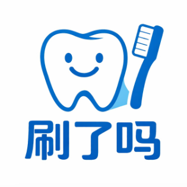

# 刷了吗



基于巴氏（Bass）刷牙法的微信小程序，引导用户科学刷牙，养成良好口腔卫生习惯。

## 功能

- **3D 牙齿模型**：实时高亮当前刷牙区域，平滑切换视角，加载失败时自动降级为文字引导
- **15 区域引导**：覆盖上下牙外侧、内侧、咬合面及舌头，每区域 10 秒，共约 2.5 分钟
- **早晚刷牙区分**：自动识别早/晚刷牙，分别记录，日历双色圆点一目了然
- **环形进度条**：conic-gradient 实时弧形进度，步骤区域名称实时显示
- **震动反馈**：步骤切换、完成、按钮点击均有触觉反馈
- **刷牙打卡**：完成后自动记录，支持暂停、跳过
- **历史日历**：月视图查看刷牙记录，统计连续天数、本月及总计，支持分享成绩
- **连续打卡激励**：3 天、7 天、30 天等里程碑提示，完成界面展示详细统计
- **分享功能**：刷牙完成后或历史页均可一键分享给好友
- **可调设置**：刷牙提醒、步骤提示音、语音播报、主题模式

## 技术栈

| 领域 | 方案 |
|------|------|
| 框架 | Taro 4 + React + TypeScript |
| Hooks | React Hooks + ahooks |
| 构建 | Vite |
| 3D 渲染 | three-platformize（Three.js 微信小程序适配） |
| 样式 | Sass + Tailwind CSS |
| 存储 | 微信本地存储 |
| 代码质量 | ESLint + Prettier |

## 项目结构

```
src/
├── pages/
│   ├── index/          # 刷牙主页（页面编排）
│   ├── history/        # 历史记录（日历 + 统计 + 分享）
│   └── settings/       # 设置（提醒、音效、主题）
├── domains/
│   └── brush/
│       ├── hooks/      # 刷牙会话：纯状态(state) + 副作用(effect) 编排
│       ├── components/ # 刷牙流程分态组件（空闲/进行中/完成/倒计时）
│       ├── effects/    # 领域副作用适配（音频/震动/亮屏）
│       └── utils.ts    # 刷牙领域工具函数
├── components/
│   ├── ToothScene/     # 3D 牙齿场景（含加载失败兜底）
│   ├── BrushTimer/     # conic-gradient 环形倒计时
│   ├── StepIndicator/  # 步骤进度点 + 区域名称
│   ├── Calendar/       # 打卡日历（早晚双色圆点）
│   └── ErrorBoundary/  # React 错误边界
├── services/
│   ├── brushing.ts     # 刷牙流程状态机
│   ├── storage.ts      # 本地存储封装（含旧数据迁移）
│   └── share.ts        # 分享文案生成
├── constants/
│   └── brushing-steps.ts  # 15 个刷牙区域定义
└── types/
    └── index.ts        # 类型定义
```

## 快速开始

```bash
# 安装依赖
pnpm install

# 开发模式
pnpm run dev:weapp

# 生产构建
pnpm run build:weapp

# 代码检查
pnpm lint

# 代码格式化
pnpm format
```

编译产物在 `dist/` 目录，用微信开发者工具导入项目根目录即可预览。

## 巴氏刷牙法 15 区域

| 步骤 | 区域 | 提示 |
|:----:|------|------|
| 1 | 上牙外侧右 | 刷右上方外侧，牙刷倾斜45度 |
| 2 | 上牙外侧前 | 刷上方门牙外侧 |
| 3 | 上牙外侧左 | 刷左上方外侧 |
| 4 | 上牙内侧右 | 翻到内侧，刷右上方内侧 |
| 5 | 上牙内侧前 | 上门牙内侧，牙刷竖起来刷 |
| 6 | 上牙内侧左 | 刷左上方内侧 |
| 7 | 上牙咬合面 | 刷上方咬合面，来回刷 |
| 8 | 下牙外侧右 | 下排牙齿，刷右下方外侧 |
| 9 | 下牙外侧前 | 刷下方门牙外侧 |
| 10 | 下牙外侧左 | 刷左下方外侧 |
| 11 | 下牙内侧右 | 翻到内侧，刷右下方内侧 |
| 12 | 下牙内侧前 | 下门牙内侧，牙刷竖起来刷 |
| 13 | 下牙内侧左 | 刷左下方内侧 |
| 14 | 下牙咬合面 | 刷下方咬合面 |
| 15 | 舌头 | 最后，轻轻刷舌头表面 |

## License

MIT
