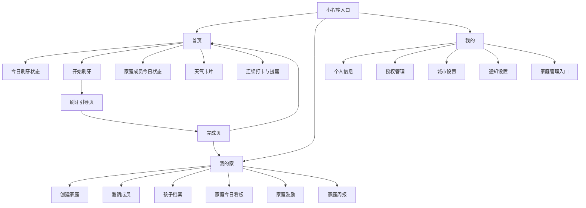
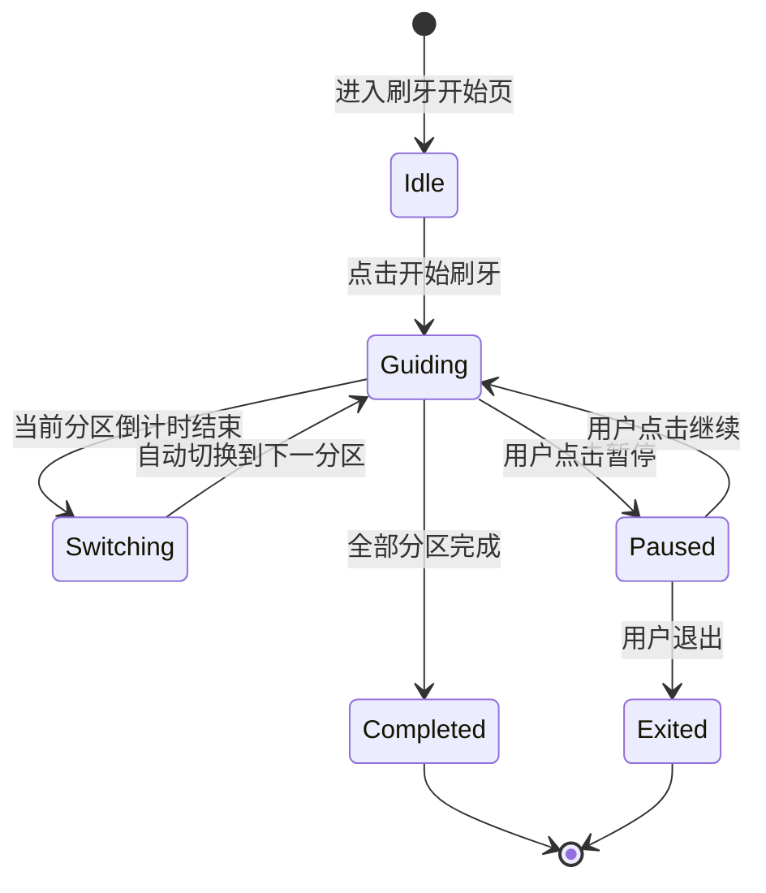
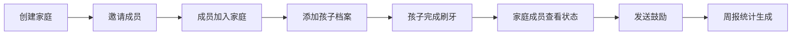

# Dentic 微信小程序 PRD

## 1. 文档信息

- 产品名称：Dentic（监督孩子刷牙）
- 文档类型：产品需求文档（PRD）
- 目标平台：微信小程序
- 版本：V1.0（MVP）

## 2. 产品概述

### 2.1 产品背景

儿童刷牙是高频日常行为，但家庭场景中的核心问题并非“刷不刷”，而是“是否刷对”：

- 孩子不知道如何正确刷牙
- 家长难以每天完整监督
- 正确刷牙方法复杂，执行难度高
- “刷了”不等于“刷对了”

传统计时器仅能约束总时长（如 2 分钟），无法解决分区、顺序、切换等过程执行问题。

### 2.2 产品定位

Dentic 是一个面向家庭场景的儿童刷牙引导小程序，核心价值不在“记录是否刷牙”，而在：

- 引导孩子按步骤完成刷牙
- 降低家长口头监督成本
- 提供家庭成员协作机制
- 为晨晚习惯养成建立入口

### 2.3 目标用户

核心用户（3-12 岁孩子家庭）：

- 担心孩子刷牙不认真、不规范的家长
- 有蛀牙、补牙经历的家庭
- 希望通过轻量工具培养习惯的家长
- 多位家庭成员共同照顾孩子的家庭

次级用户：

- 幼师相关从业者
- 儿童习惯培养关注者
- 儿童健康/口腔护理内容传播人群

### 2.4 产品目标

业务目标：

- 验证儿童刷牙引导需求
- 提升小程序日活与家庭协作率
- 建立儿童习惯养成入口
- 为后续晨晚任务扩展奠定基础

用户目标：

- 孩子：知道当前刷牙区域、剩余时长、下一步动作
- 家长：减少反复催促与全过程监督成本
- 家庭成员：共同参与习惯培养

## 3. 功能范围

本期范围包含 3 个模块：

- 儿童刷牙引导
- 天气信息展示
- 我的家（家庭协作）

## 4. 功能设计

### 4.1 模块一：儿童刷牙引导

#### 4.1.1 功能目标

帮助孩子完成分区引导、时长控制、步骤切换，提升刷牙执行质量。

#### 4.1.2 用户价值

- 孩子不再“凭感觉乱刷”
- 家长减少全程盯刷
- 刷牙从抽象要求变为可执行流程

#### 4.1.3 详细功能

1. 刷牙开始页
- 展示当前时段（早刷/晚刷）
- 展示总预计时长
- 展示今日完成状态
- 提供“开始刷牙”入口

2. 分区引导
- 按牙齿区域拆分引导（示例）：左上、右上、左下、右下、前牙外侧、前牙内侧、咬合面
- 每区域独立计时并提示切换
- 展示当前区域图示、剩余时间、下一步提示、当前进度

3. 步骤切换提醒
- 单区域结束后自动切换下一步
- 支持动画、文字、音效提醒
- 音效可配置开关

4. 完成反馈
- 展示今日早/晚刷完成状态
- 展示总时长
- 展示是否全流程完成
- 展示鼓励文案或小奖励反馈

5. 打卡记录
- 记录早晚刷完成情况，用于家庭协作与统计
- 记录字段：日期、时段（早/晚）、完成时间、完成时长、是否全流程完成

### 4.2 模块二：天气展示

#### 4.2.1 功能目标

通过天气卡片增强晨晚场景相关性，提升首页打开率。

#### 4.2.2 功能定位

天气为辅助信息层，不抢占刷牙主流程注意力。

#### 4.2.3 逻辑规则

- 白天展示“今天天气”：当前天气、最高/最低温、降雨提示、出门建议
- 晚上 20:00 后展示“明天天气”：次日天气、温度区间、降雨提示、穿衣/出门建议

#### 4.2.4 授权逻辑

- 默认不强制位置授权
- 首页显示“开启本地天气”提示
- 用户主动点击后触发授权
- 授权失败时支持手动选择城市

#### 4.2.5 展示位置

- 首页上半区优先展示刷牙状态
- 下方展示天气卡片（城市、图标、温度、建议文案）

### 4.3 模块三：我的家（家庭协作）

#### 4.3.1 功能目标

将“单家长监督”升级为“家庭协作参与习惯培养”。

#### 4.3.2 角色设计

管理者（通常父母之一）：

- 创建家庭
- 邀请成员
- 添加孩子
- 配置提醒规则
- 管理成员权限

协作者（另一位家长/祖辈等）：

- 查看孩子状态
- 参与提醒
- 发送鼓励
- 查看打卡统计

孩子：

- 参与刷牙打卡
- 查看成就或奖励
- 接收家庭鼓励反馈

#### 4.3.3 详细功能

1. 创建家庭
- 字段：家庭名称、创建者、默认孩子档案

2. 邀请家庭成员
- 方式：邀请码或小程序分享链接
- 权限：查看家庭看板、查看记录、发送鼓励

3. 孩子档案
- 字段：昵称、年龄段、头像、刷牙计划
- 支持后续扩展多孩子

4. 家庭今日状态看板
- 展示早刷/晚刷完成状态
- 展示成员查看/陪伴/提醒状态
- 展示当日家庭鼓励情况

5. 家庭鼓励
- 轻互动反馈：小红花、点赞、做得真棒、晚上继续加油
- 非即时聊天工具定位

6. 家庭周报
- 每周生成：早晚刷完成率、连续打卡天数、易漏刷日期、成员参与度

## 5. 页面结构

### 5.1 首页

模块优先级：

1. 今日刷牙状态
2. 开始刷牙入口
3. 家庭成员今日状态
4. 天气卡片
5. 连续打卡/今日提醒

### 5.2 刷牙引导页

- 当前区域图示
- 当前区域计时
- 进度条
- 下一步提示
- 暂停/退出按钮

### 5.3 完成页

- 完成反馈
- 今日状态
- 奖励信息
- 返回首页/分享给家庭成员

### 5.4 我的家页

- 家庭名称
- 家庭成员列表
- 孩子档案
- 今日看板
- 家庭鼓励区
- 本周概览

### 5.5 我的页

- 个人信息
- 授权管理
- 城市设置
- 通知设置
- 家庭管理入口

## 6. 用户流程

### 6.1 新用户首次使用

1. 进入小程序
2. 查看首页
3. 点击开始刷牙
4. 完成分区引导
5. 展示完成页
6. 引导创建“我的家”
7. 引导开启天气和提醒

### 6.2 家庭协作流程

1. 用户创建家庭
2. 邀请家庭成员加入
3. 添加孩子档案
4. 孩子完成刷牙
5. 家庭成员查看并鼓励
6. 周报生成

## 7. 非功能需求

### 7.1 易用性

- 首页信息清晰，避免复杂层级
- 儿童引导界面直观易懂
- 家长操作路径短、学习成本低

### 7.2 体验要求

- 刷牙引导页切换流畅
- 页面加载快速，适配高频轻使用
- 天气与家庭信息不干扰主流程

### 7.3 可扩展性

底层设计应支持：

- 任务配置能力
- 多孩子支持
- 家庭角色支持
- 周报与统计能力

## 8. 数据指标

### 8.1 核心指标

- 首次刷牙完成率
- 次日留存
- 7 日留存
- 家庭创建率
- 家庭成员邀请成功率
- 早刷/晚刷打卡率
- 连续打卡天数

### 8.2 功能指标

- 天气授权率
- 天气卡片点击率
- 家庭鼓励使用率
- 周报查看率
- 单个孩子平均每日完成次数

## 9. MVP 范围

### 9.1 MVP 必做

- 首页
- 分区引导刷牙
- 完成页
- 早晚打卡记录
- 创建家庭
- 邀请一个家庭成员
- 家庭今日状态查看
- 基础天气展示

### 9.2 MVP 可延后

- 家庭周报
- 多孩子支持
- 勋章体系
- 高级提醒配置
- 个性化刷牙方案

## 10. 风险与应对

### 10.1 主要风险

- 被误解为普通计时器
- 儿童长期跟随引导意愿不足
- 家长创建家庭协作意愿不足
- 天气功能分散主流程注意力

### 10.2 应对策略

- 明确强调“儿童刷牙引导”而非“记录”
- 首页突出“现在刷哪里、刷多久”
- 我的家先做轻协作，不做复杂社交
- 天气定位为陪衬信息，不喧宾夺主

## 11. 未来扩展方向

在刷牙闭环跑通后，逐步扩展至儿童晨晚习惯任务：

- 洗脸
- 喝水
- 早睡
- 读书
- 上学准备

长期定位升级为：家庭儿童习惯养成平台。

## 12. 一句话版本

这是一个通过分区引导、过程监督与家庭协作，帮助孩子更容易刷对牙、帮助家长更轻松参与习惯培养的微信小程序。

## 13. 信息架构图（Mermaid）

### 13.1 全局信息架构

### 13.2 刷牙流程状态图

### 13.3 家庭协作流程图

## 14. 页面原型说明

### 14.1 首页原型说明

页面目标：展示今日刷牙状态并引导快速开始。

关键模块：

- 今日状态卡（早刷/晚刷）
- 开始刷牙主按钮
- 家庭成员状态卡
- 天气卡片
- 连续打卡与提醒信息

页面状态：

- 默认态：展示完整模块
- 空态：无家庭时提示创建家庭
- 加载态：天气信息 skeleton
- 异常态：天气获取失败时展示重试与手动选城

关键交互：

- 点击“开始刷牙”进入刷牙引导页
- 点击天气卡片进入天气详情或权限引导
- 点击家庭状态进入“我的家”

埋点建议：

- `home_view`
- `home_start_brush_click`
- `home_weather_card_click`
- `home_family_card_click`

### 14.2 刷牙引导页原型说明

页面目标：按区域、按顺序引导孩子完成完整刷牙流程。

关键模块：

- 当前区域图示
- 区域倒计时
- 全流程进度条
- 下一步提示
- 暂停/继续、退出

页面状态：

- 倒计时态：分区执行中
- 切换态：分区完成动画/音效
- 暂停态：计时暂停，展示继续入口
- 异常态：音效不可用时自动降级文字提示

关键交互：

- 计时结束自动切换下一分区
- 用户可暂停/继续
- 用户可中途退出并二次确认

埋点建议：

- `brush_start`
- `brush_step_complete`
- `brush_pause`
- `brush_resume`
- `brush_exit`
- `brush_complete`

### 14.3 完成页原型说明

页面目标：反馈完成结果并强化正向激励。

关键模块：

- 完成结果卡（早/晚刷状态）
- 本次总时长
- 全流程完成标记
- 奖励与鼓励文案
- 返回首页/分享家庭成员按钮

页面状态：

- 全流程完成态：展示完整奖励
- 非完整流程态：展示鼓励补全提示

关键交互：

- 点击返回首页
- 点击分享给家庭成员

埋点建议：

- `brush_complete_view`
- `brush_complete_back_home_click`
- `brush_complete_share_click`

### 14.4 我的家页原型说明

页面目标：承载家庭协作与参与行为。

关键模块：

- 家庭基础信息（名称、成员）
- 孩子档案
- 今日看板（早晚刷、成员参与）
- 家庭鼓励区
- 本周概览

页面状态：

- 未建家空态：引导创建家庭
- 已建家默认态：展示家庭信息
- 成员待加入态：展示邀请入口与状态

关键交互：

- 创建家庭
- 邀请成员
- 编辑孩子档案
- 发送鼓励

埋点建议：

- `family_view`
- `family_create_click`
- `family_invite_click`
- `family_encourage_send`

### 14.5 我的页原型说明

页面目标：提供个人设置和权限管理入口。

关键模块：

- 个人信息
- 授权管理
- 城市设置
- 通知设置
- 家庭管理入口

页面状态：

- 默认态：展示全部设置项
- 权限异常态：提示重试授权或前往系统设置

关键交互：

- 修改城市
- 开关通知
- 跳转家庭管理

埋点建议：

- `profile_view`
- `profile_city_update`
- `profile_notify_toggle`
- `profile_permission_manage_click`
