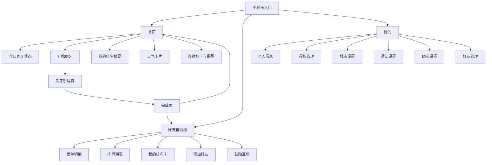
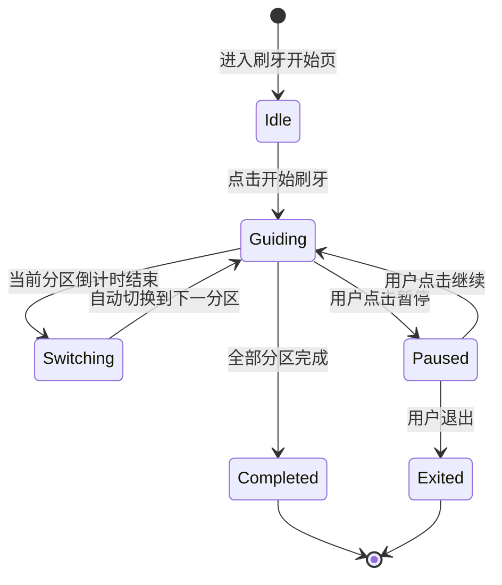
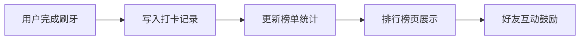

# Dentic 微信小程序 PRD

## 1. 文档信息

- 产品名称：Dentic（监督孩子刷牙）
- 文档类型：产品需求文档（PRD）
- 目标平台：微信小程序
- 版本：V1.1（去家庭协作，改好友排行榜）

## 2. 产品概述

### 2.1 产品背景

儿童刷牙是高频行为，但核心问题不是“刷不刷”，而是“是否刷对”：

- 孩子不知道如何正确刷牙
- 家长难以每天完整监督
- 正确刷牙方法执行复杂
- “刷了”不等于“刷对了”

传统计时器只能解决总时长，无法解决分区、顺序、切换等过程问题。

### 2.2 产品定位

Dentic 是一个面向亲子场景的儿童刷牙引导小程序，核心价值：

- 引导孩子按步骤完成刷牙
- 降低家长口头监督成本
- 通过好友排行榜强化坚持动力
- 建立晨晚习惯养成入口

### 2.3 目标用户

核心用户：有 3-12 岁孩子的家长。

- 担心孩子刷牙不认真、不规范
- 有蛀牙或补牙经历
- 希望用轻量工具培养习惯
- 对打卡和排行榜有接受度

次级用户：

- 幼师相关从业者
- 儿童习惯培养关注人群
- 儿童健康内容传播人群

### 2.4 产品目标

业务目标：

- 验证儿童刷牙引导需求
- 提升 DAU 与留存
- 验证“好友排行榜”对坚持率的提升效果

用户目标：

- 孩子：知道现在刷哪里、刷多久、下一步是什么
- 家长：减少催促与监督成本
- 用户：能看到自己在好友中的完成表现

## 3. 功能范围

本期范围包含 3 个模块：

- 儿童刷牙引导
- 天气信息展示
- 好友排行榜

## 4. 功能设计

### 4.1 模块一：儿童刷牙引导

#### 4.1.1 功能目标

帮助孩子完成分区引导、时长控制、步骤切换，提升刷牙执行质量。

#### 4.1.2 用户价值

- 孩子不再“凭感觉乱刷”
- 家长减少全程盯刷
- 刷牙从抽象要求变为可执行流程

#### 4.1.3 详细功能

1. 刷牙开始页
- 展示当前时段（早刷/晚刷）
- 展示总预计时长
- 展示今日完成状态
- 提供“开始刷牙”入口

2. 分区引导
- 按牙齿区域拆分引导（示例）：左上、右上、左下、右下、前牙外侧、前牙内侧、咬合面
- 每区域独立计时并提示切换
- 展示当前区域图示、剩余时间、下一步提示、当前进度

3. 步骤切换提醒
- 单区域结束后自动切换下一步
- 支持动画、文字、音效提醒
- 音效可配置开关

4. 完成反馈
- 展示今日早/晚刷完成状态
- 展示总时长
- 展示是否全流程完成
- 展示鼓励文案/小奖励反馈

5. 打卡记录
- 记录字段：日期、时段（早/晚）、完成时间、完成时长、是否全流程完成
- 记录用于本地历史统计与排行榜计算

### 4.2 模块二：天气展示

#### 4.2.1 功能目标

通过天气信息增强晨晚场景关联，提升首页打开率。

#### 4.2.2 功能定位

天气为辅助信息层，不抢占刷牙主流程注意力。

#### 4.2.3 逻辑规则

- 白天展示“今天天气”：当前天气、最高/最低温、降雨提示、出门建议
- 晚上 20:00 后展示“明天天气”：次日天气、温度区间、降雨提示、穿衣建议

#### 4.2.4 授权逻辑

- 默认不强制位置授权
- 首页提示“开启本地天气”
- 用户主动点击后触发授权
- 授权失败时支持手动选择城市

### 4.3 模块三：好友排行榜

#### 4.3.1 功能目标

通过“已注册好友”之间的进度对比，提升刷牙习惯持续性。

#### 4.3.2 能力边界

- 产品口径为“微信好友排行榜”
- 技术实现采用“站内好友关系榜”：仅统计已注册且已建立关系的好友
- 不直接拉取用户全量微信好友列表

#### 4.3.3 详细功能

1. 好友关系建立
- 支持通过分享卡片/邀请码添加好友
- 仅双方确认后建立双向关系

2. 排行榜维度
- 今日完成次数榜
- 本周完成率榜
- 连续打卡天数榜

3. 榜单展示字段
- 昵称、头像
- 今日早刷/晚刷状态
- 本周完成率
- 连续打卡天数
- 排名变化（较昨日）

4. 互动能力
- 对好友发送轻量鼓励（点赞/加油）
- 不做聊天功能

5. 隐私控制
- 用户可关闭“被排行榜展示”
- 用户可移除好友关系

## 5. 页面结构

### 5.1 首页

模块优先级：

1. 今日刷牙状态
2. 开始刷牙入口
3. 好友榜摘要（我的排名）
4. 天气卡片
5. 连续打卡/今日提醒

### 5.2 刷牙引导页

- 当前区域图示
- 当前区域计时
- 进度条
- 下一步提示
- 暂停/退出按钮

### 5.3 完成页

- 完成反馈
- 今日状态
- 奖励信息
- 返回首页/去看好友榜

### 5.4 好友排行榜页

- 榜单切换（今日/本周/连续）
- 排行列表
- 我的排名卡
- 添加好友入口
- 鼓励互动入口

### 5.5 我的页

- 个人信息
- 授权管理
- 城市设置
- 通知设置
- 隐私设置（榜单可见性）
- 好友管理入口

## 6. 用户流程

### 6.1 新用户首次使用

1. 进入小程序
2. 查看首页
3. 点击开始刷牙
4. 完成分区引导
5. 展示完成页
6. 引导添加好友
7. 引导开启天气与提醒

### 6.2 排行榜使用流程

1. 用户完成刷牙
2. 打卡记录写入
3. 进入好友排行榜页
4. 查看我的排名与好友表现
5. 对好友发送鼓励

## 7. 非功能需求

### 7.1 易用性

- 首页信息清晰，避免复杂层级
- 儿童引导界面视觉直观
- 家长操作路径短

### 7.2 体验要求

- 刷牙引导页切换流畅
- 页面加载快
- 天气和排行榜信息不干扰主流程

### 7.3 可扩展性

底层设计需支持：

- 任务配置能力
- 好友关系模型
- 榜单统计能力
- 周期统计能力

## 8. 数据指标

### 8.1 核心指标

- 首次刷牙完成率
- 次日留存
- 7 日留存
- 早刷/晚刷打卡率
- 连续打卡天数

### 8.2 功能指标

- 天气授权率
- 天气卡片点击率
- 好友添加成功率
- 排行榜访问率
- 榜单互动使用率（点赞/鼓励）

## 9. MVP 范围

### 9.1 MVP 必做

- 首页
- 分区引导刷牙
- 完成页
- 早晚打卡记录
- 好友添加（邀请码/分享）
- 好友排行榜（至少一个榜单：本周完成率）
- 基础天气展示

### 9.2 MVP 可延后

- 多榜单切换（今日/本周/连续全部）
- 排名变化趋势
- 更丰富勋章体系
- 个性化刷牙方案

## 10. 风险与应对

### 10.1 主要风险

- 用户误解为普通计时器
- 排行榜竞争压力导致体验分化
- 微信能力边界导致“好友”预期不一致

### 10.2 应对策略

- 首页强调“刷牙引导”而非仅计时
- 排行榜加入鼓励导向文案，弱化惩罚感
- 在产品内明确“已注册好友榜”定义

## 11. 未来扩展方向

刷牙闭环跑通后，逐步扩展到晨晚习惯任务：

- 洗脸
- 喝水
- 早睡
- 读书
- 上学准备

长期定位：儿童习惯养成平台。

## 12. 一句话版本

这是一个通过分区引导与过程监督帮助孩子刷对牙，并用好友排行榜提升坚持动力的微信小程序。

## 13. 信息架构图（Mermaid）

### 13.1 全局信息架构

### 13.2 刷牙流程状态图

### 13.3 排行榜数据流

## 14. 页面原型说明

### 14.1 首页原型说明

页面目标：展示今日刷牙状态并引导快速开始。

关键模块：

- 今日状态卡（早刷/晚刷）
- 开始刷牙主按钮
- 我的好友榜排名摘要
- 天气卡片
- 连续打卡与提醒

页面状态：

- 默认态：展示完整模块
- 空态：未添加好友时展示“添加好友”引导
- 加载态：天气信息 skeleton
- 异常态：天气获取失败时展示重试与手动选城

关键交互：

- 点击“开始刷牙”进入刷牙引导页
- 点击排名摘要进入排行榜页
- 点击天气卡片进入天气详情/权限引导

埋点建议：

- `home_view`
- `home_start_brush_click`
- `home_rank_card_click`
- `home_weather_card_click`

### 14.2 刷牙引导页原型说明

页面目标：按区域、按顺序引导孩子完成刷牙。

关键模块：

- 当前区域图示
- 区域倒计时
- 全流程进度条
- 下一步提示
- 暂停/继续、退出

页面状态：

- 倒计时态
- 切换态
- 暂停态
- 异常态（音效不可用自动降级）

关键交互：

- 计时结束自动切换下一分区
- 用户可暂停/继续
- 用户可中途退出并二次确认

埋点建议：

- `brush_start`
- `brush_step_complete`
- `brush_pause`
- `brush_resume`
- `brush_exit`
- `brush_complete`

### 14.3 完成页原型说明

页面目标：反馈完成结果并引导查看排名。

关键模块：

- 完成结果卡（早/晚刷状态）
- 本次总时长
- 全流程完成标记
- 奖励文案
- 返回首页/查看好友榜按钮

页面状态：

- 全流程完成态
- 非完整流程态

关键交互：

- 点击返回首页
- 点击查看好友榜

埋点建议：

- `brush_complete_view`
- `brush_complete_back_home_click`
- `brush_complete_go_rank_click`

### 14.4 好友排行榜页原型说明

页面目标：展示好友间刷牙完成表现，提升持续打卡动力。

关键模块：

- 榜单类型切换
- 排名列表
- 我的排名卡
- 添加好友入口
- 鼓励互动按钮

页面状态：

- 默认态：有好友有数据
- 空态：无好友或无数据
- 加载态：榜单数据加载

关键交互：

- 切换榜单
- 添加好友
- 给好友点赞/鼓励

埋点建议：

- `rank_view`
- `rank_tab_switch`
- `rank_add_friend_click`
- `rank_encourage_click`

### 14.5 我的页原型说明

页面目标：管理个人设置、权限与好友可见性。

关键模块：

- 个人信息
- 授权管理
- 城市设置
- 通知设置
- 榜单可见性设置
- 好友管理

页面状态：

- 默认态
- 权限异常态

关键交互：

- 修改城市
- 开关通知
- 修改榜单可见性
- 管理好友关系

埋点建议：

- `profile_view`
- `profile_city_update`
- `profile_notify_toggle`
- `profile_rank_visibility_toggle`
- `profile_friend_manage_click`
