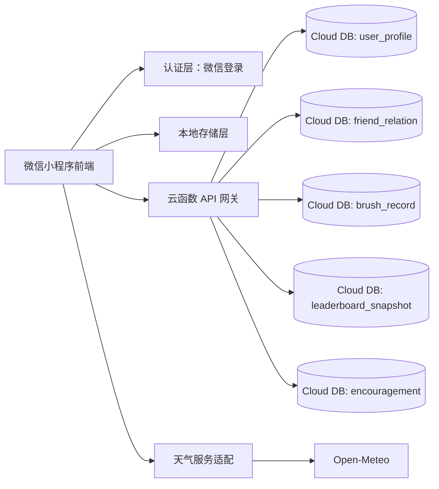
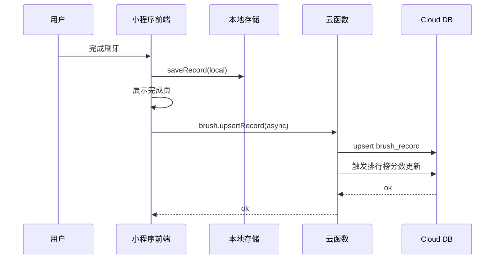
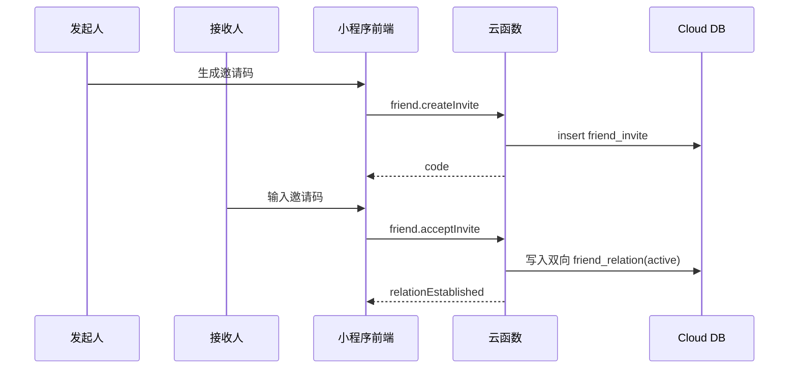

# Dentic 微信小程序技术文档（基于 PRD V1.1）

## 1. 文档目标

本文档将 PRD V1.1（去家庭协作、改好友排行榜）转化为可落地技术方案，覆盖：

- 系统架构与模块边界
- 数据模型与索引
- API/云函数契约
- 前端改造方案
- 埋点口径与验收标准

## 2. 现状与差距

### 2.1 当前工程现状

- 技术栈：Taro 4 + React + TypeScript
- 页面：`index / history / settings`
- 现有能力：15 区域刷牙引导、本地打卡记录、本地设置、基础天气
- 存储：微信本地存储（记录/设置/天气缓存）

### 2.2 与新 PRD 的差距

- 缺好友关系域（添加好友、双向关系、隐私可见性）
- 缺排行榜域（日榜/周榜/连续打卡榜）
- 缺排行榜互动能力（点赞/加油）
- 缺统一埋点与数据口径

## 3. 能力边界（微信约束）

- 小程序无法直接拉取用户全量微信好友列表
- “微信好友排行榜”技术实现采用“站内好友关系榜”：
  - 双方均注册本小程序
  - 通过分享卡片/邀请码建立双向好友关系
  - 仅在该关系集合内计算和展示排行榜

## 4. 总体技术架构

### 4.1 架构原则

- 刷牙主流程本地优先，弱网可完成
- 排行榜与好友关系云端统一计算，保证多端一致
- 埋点与业务写入解耦，不阻塞主流程

### 4.2 逻辑架构



### 4.3 技术选型

- 前端：沿用 Taro + React
- 云端：微信云开发（Cloud Functions + Cloud Database）
- 身份：`openid` 作为用户唯一标识
- 天气：Open-Meteo + 本地缓存
- 统计：前端埋点上报云函数

## 5. 前端改造设计

### 5.1 新增目录

- `src/domains/rank/`：排行榜域（状态、仓储、组件）
- `src/domains/friend/`：好友域（关系管理、邀请）
- `src/services/api/`：云函数调用封装
- `src/services/auth/`：登录态与 `openid`
- `src/services/analytics/`：埋点上报
- `src/pages/rank/`：好友排行榜页
- `src/pages/profile/`：我的页（可见性与好友管理）

### 5.2 页面路由调整

`app.config.ts` 目标页：

- `pages/index/index`
- `pages/rank/index`
- `pages/profile/index`
- `pages/history/index`（保留）
- `pages/settings/index`（保留）

### 5.3 刷牙流程改造

- 保留现有状态机（`idle/countdown/brushing/paused/completed`）
- 完成后写入策略：
  1. 先写本地记录
  2. 异步上报云端 `brush.upsertRecord`
  3. 上报失败进入重试队列（下次启动补偿）

### 5.4 首页改造

- 新增“我的排名摘要卡”
- 无好友时展示“添加好友引导卡”
- 天气模块保持辅助层，不遮挡刷牙入口

### 5.5 排行榜页改造

- 榜单类型切换：`today / weekly / streak`
- 展示：排名、昵称、头像、核心指标、排名变化
- 互动：点赞/加油
- 空态：暂无好友、好友暂无数据

## 6. 云端数据模型

### 6.1 集合设计

1. `user_profile`
- `_id`
- `openid`（唯一）
- `nickname`
- `avatar`
- `rankVisibility`（public/friends_only/private）
- `cityCode`（可空）
- `createdAt`
- `updatedAt`

2. `friend_relation`
- `_id`
- `userOpenId`
- `friendOpenId`
- `status`（pending/active/blocked）
- `source`（invite/share）
- `createdAt`
- `updatedAt`

约束：双向各一条记录，`active` 才计入榜单。

3. `friend_invite`
- `_id`
- `code`
- `fromOpenId`
- `expireAt`
- `maxUse`
- `usedCount`
- `status`（active/expired/revoked）

4. `brush_record`
- `_id`
- `openId`
- `bizDate`（YYYY-MM-DD，6:00 切日）
- `session`（morning/evening）
- `completed`
- `durationSec`
- `completedSteps`
- `source`（local_sync/direct）
- `createdAt`

5. `leaderboard_snapshot`（可选，MVP 可实时算）
- `_id`
- `periodType`（today/weekly/streak）
- `dateKey`
- `openId`
- `score`
- `rank`
- `createdAt`

6. `encouragement`
- `_id`
- `fromOpenId`
- `toOpenId`
- `bizDate`
- `type`（like/cheer）
- `message`
- `createdAt`

### 6.2 索引建议

- `user_profile.openid` 唯一索引
- `friend_relation.userOpenId + friendOpenId` 唯一索引
- `friend_invite.code` 唯一索引
- `brush_record.openId + bizDate + session` 唯一索引
- `leaderboard_snapshot.periodType + dateKey + rank` 普通索引

## 7. API/云函数契约

统一响应：

```json
{
  "code": 0,
  "message": "ok",
  "data": {}
}
```

错误码：

- `4001` 参数错误
- `4003` 无权限
- `4004` 资源不存在
- `4090` 状态冲突
- `5000` 系统错误

### 7.1 好友域接口

1. `friend.createInvite`
- 入参：`{}`
- 出参：`{ code: string, expireAt: number }`

2. `friend.acceptInvite`
- 入参：`{ code: string }`
- 出参：`{ relationEstablished: true }`

3. `friend.list`
- 入参：`{}`
- 出参：`{ friends: Array<{ openId, nickname, avatar, status }> }`

4. `friend.remove`
- 入参：`{ friendOpenId: string }`
- 出参：`{ removed: true }`

### 7.2 刷牙记录接口

1. `brush.upsertRecord`
- 入参：`{ bizDate, session, completed, durationSec, completedSteps, source }`
- 出参：`{ recordId }`

2. `brush.getDailyStatus`
- 入参：`{ bizDate }`
- 出参：`{ morningDone, eveningDone, morningTime?, eveningTime? }`

### 7.3 排行榜接口

1. `rank.getLeaderboard`
- 入参：`{ periodType: 'today' | 'weekly' | 'streak', page, pageSize }`
- 出参：`{ list: Array<RankItem>, myRank: RankItem | null }`

`RankItem`：

```json
{
  "openId": "string",
  "nickname": "string",
  "avatar": "string",
  "score": 0,
  "rank": 1,
  "rankDelta": -1,
  "todayDone": true,
  "weeklyRate": 0.86,
  "streakDays": 5
}
```

2. `rank.sendEncouragement`
- 入参：`{ toOpenId: string, type: 'like' | 'cheer', message?: string }`
- 出参：`{ encouragementId: string }`

### 7.4 用户设置接口

1. `user.updateRankVisibility`
- 入参：`{ rankVisibility: 'public' | 'friends_only' | 'private' }`
- 出参：`{ success: true }`

## 8. 时序设计

### 8.1 刷牙完成并入榜



### 8.2 添加好友



## 9. 权限与安全

- 位置权限仅用于天气
- 云函数内按 `openid` 做鉴权与关系校验
- 排行榜可见性按 `rankVisibility` 控制
- 不采集微信通讯录或全量好友数据
- 关键表保留审计字段（`createdAt/updatedAt`）

## 10. 埋点设计（MVP）

核心事件：

- `home_view`
- `home_start_brush_click`
- `home_rank_card_click`
- `brush_start`
- `brush_step_complete`
- `brush_complete`
- `rank_view`
- `rank_tab_switch`
- `rank_add_friend_click`
- `rank_encourage_click`
- `friend_invite_created`
- `friend_invite_accepted`
- `weather_permission_request`
- `weather_permission_granted`
- `weather_permission_denied`

公共字段：

- `eventTime`
- `page`
- `openid`
- `appVersion`
- `networkType`

## 11. 兼容与迁移

- 旧本地打卡数据继续有效
- 新版增加云同步与榜单，不影响纯本地流程
- 未添加好友时排行榜页显示空态，不报错
- 后续可从“站内好友榜”平滑扩展更多社交关系来源

## 12. 测试与验收

### 12.1 功能验收

- 刷牙流程完整可用
- 排行榜可展示、可切换、可互动
- 添加好友与移除好友链路可用
- 天气授权成功/失败分支可用

### 12.2 技术验收

- 本地写记录成功率 >= 99.9%
- 云端上报成功率 >= 99%（含重试）
- 排行榜接口 P95 < 500ms
- 首页首屏渲染（缓存命中）< 1.5s

### 12.3 数据验收

- `brush_complete` 与 `brush_record` 日汇总偏差 <= 3%
- 好友添加成功率、排行榜访问率可日级观测

## 13. 里程碑

- M1（3-5 天）：好友关系与排行榜云端模型 + 基础接口
- M2（4-6 天）：前端排行榜页、首页排名摘要、好友管理
- M3（3-4 天）：云同步重试、埋点、联调
- M4（2-3 天）：灰度与线上验证

## 14. 非目标（MVP 不做）

- 聊天能力
- 复杂社交广场
- 全量微信好友自动同步
- 个性化刷牙路径算法
