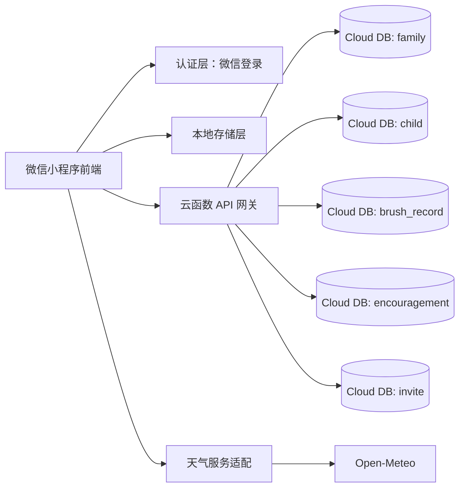
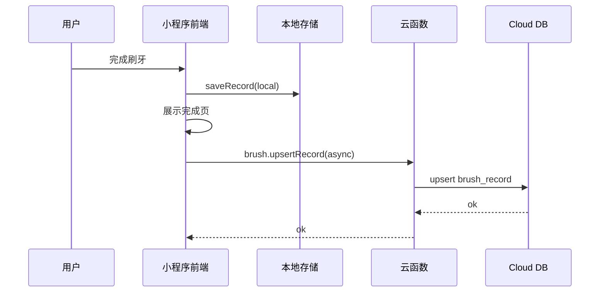
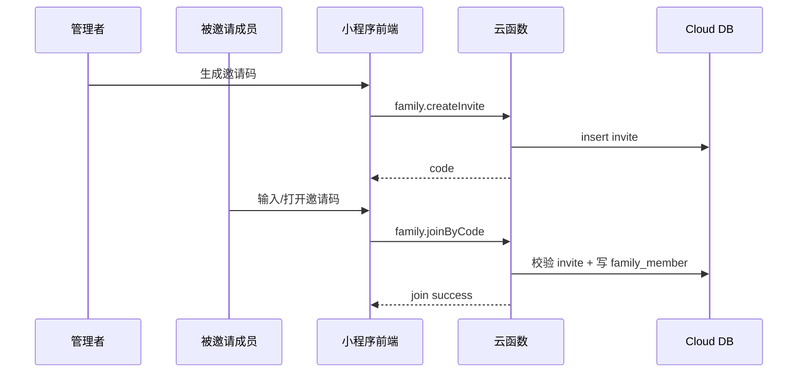

# Dentic 微信小程序技术文档（基于 PRD V1.0）

## 1. 文档目标

本文档用于将 `docs/prd/wechat-miniapp-kids-brushing-prd.md` 转化为可开发的技术方案，覆盖：

- 系统架构与模块边界
- 数据模型与存储策略
- API 与云函数契约
- 小程序端改造方案
- 事件埋点与质量保障
- 里程碑与发布策略

## 2. 现状与差距

### 2.1 当前工程现状（已存在）

- 端技术栈：Taro 4 + React + TypeScript
- 页面：`index / history / settings`
- 核心能力：15 区域刷牙流程、本地打卡记录、本地设置、基础天气显示
- 存储：微信本地存储（记录/设置/天气缓存）

### 2.2 与 PRD 的关键差距（需新增）

- 家庭协作域（家庭、成员、孩子、鼓励、周报）
- 多设备协同（仅本地存储无法满足家庭共享）
- 可运营埋点口径（目前缺统一事件模型）
- 首页信息结构需升级为“刷牙 + 家庭 + 天气”组合看板

## 3. 总体技术架构

### 3.1 架构原则

- 刷牙引导链路优先本地可用（弱网可完成）
- 家庭协作能力基于云端（保证跨成员一致性）
- 先实现 MVP 最小闭环，再迭代周报与多孩子

### 3.2 逻辑架构



### 3.3 技术选型

- 前端：沿用现有 Taro + React 架构
- 云端：微信云开发（Cloud Functions + Cloud Database）
- 鉴权：微信 `openid` 作为用户唯一标识
- 天气：延续 Open-Meteo（客户端请求，缓存 + 授权降级）
- 统计：前端埋点上报至云函数，再入库

## 4. 前端改造设计

### 4.1 目录与模块新增

建议新增以下目录：

- `src/domains/family/`：家庭域（状态、仓储、组件）
- `src/services/api/`：云函数调用封装（统一错误码）
- `src/services/auth/`：登录态、`openid` 获取与缓存
- `src/pages/family/`：我的家页（主入口）
- `src/pages/profile/`：我的页（权限、城市、通知）
- `src/services/analytics/`：埋点发送与批量缓冲

### 4.2 页面路由调整

`app.config.ts` 目标页集合（MVP）：

- `pages/index/index`（首页/刷牙主流程）
- `pages/family/index`（我的家）
- `pages/profile/index`（我的）
- `pages/history/index`（历史，保留）
- `pages/settings/index`（设置，保留）

### 4.3 刷牙流程模块改造

现有刷牙状态机继续复用，新增两个扩展点：

- 完成后写入双存储：本地记录 + 云端记录（异步，不阻塞完成页）
- 完成后触发家庭看板刷新（存在家庭关系时）

数据写入策略：

1. 先写本地，保证体验闭环。
2. 再上报云端，失败进入重试队列。
3. 下次启动时自动补偿失败上报。

### 4.4 天气模块改造

- 保留当前 `location -> open-meteo -> cache` 流程
- 增加“手动选城”配置持久化（`profile` 页管理）
- 晚上 20:00 以后增加“明日天气”展示分支

## 5. 云端数据模型

### 5.1 集合设计

1. `user_profile`
- `_id`
- `openid`（唯一索引）
- `nickname`
- `avatar`
- `cityCode`（可空）
- `createdAt`
- `updatedAt`

2. `family`
- `_id`
- `name`
- `ownerOpenId`
- `status`（active/dissolved）
- `createdAt`
- `updatedAt`

3. `family_member`
- `_id`
- `familyId`
- `openId`
- `role`（admin/collaborator）
- `joinedAt`
- `status`（active/pending/removed）

4. `child_profile`
- `_id`
- `familyId`
- `nickname`
- `ageRange`（3-5 / 6-8 / 9-12）
- `avatar`
- `brushPlanVersion`
- `createdAt`
- `updatedAt`

5. `brush_record`
- `_id`
- `familyId`（可空，单人模式）
- `childId`（可空，MVP 单孩子可默认）
- `openId`（操作者）
- `bizDate`（业务日 YYYY-MM-DD，按 6:00 分界）
- `session`（morning/evening）
- `completed`
- `durationSec`
- `completedSteps`
- `source`（local_sync/direct）
- `createdAt`

唯一约束建议：`familyId + childId + bizDate + session`。

6. `encouragement`
- `_id`
- `familyId`
- `childId`
- `fromOpenId`
- `type`（flower/like/praise/cheer）
- `message`
- `createdAt`

7. `invite`
- `_id`
- `familyId`
- `code`（短码）
- `createdBy`
- `expireAt`
- `maxUse`
- `usedCount`
- `status`（active/expired/revoked）

### 5.2 索引建议

- `user_profile.openid` 唯一索引
- `family_member.familyId + openId` 复合唯一索引
- `brush_record.familyId + childId + bizDate + session` 唯一索引
- `invite.code` 唯一索引

## 6. API/云函数契约

所有接口统一返回：

```json
{
  "code": 0,
  "message": "ok",
  "data": {}
}
```

错误码约定：

- `4001` 参数错误
- `4003` 无权限
- `4004` 资源不存在
- `4090` 状态冲突（如重复加入）
- `5000` 系统错误

### 6.1 家庭域接口

1. `family.create`
- 入参：`{ name: string }`
- 出参：`{ familyId: string }`

2. `family.getMyHome`
- 入参：`{}`
- 出参：`{ family, members, children, todayBoard }`

3. `family.createInvite`
- 入参：`{ familyId: string }`
- 出参：`{ code: string, expireAt: number }`

4. `family.joinByCode`
- 入参：`{ code: string }`
- 出参：`{ familyId: string, role: string }`

5. `family.addChild`
- 入参：`{ familyId, nickname, ageRange, avatar? }`
- 出参：`{ childId }`

6. `family.sendEncouragement`
- 入参：`{ familyId, childId, type, message? }`
- 出参：`{ encouragementId }`

### 6.2 刷牙记录接口

1. `brush.upsertRecord`
- 入参：`{ familyId?, childId?, bizDate, session, completed, durationSec, completedSteps, source }`
- 出参：`{ recordId }`

2. `brush.getDailyStatus`
- 入参：`{ familyId?, childId?, bizDate }`
- 出参：`{ morningDone, eveningDone, morningTime?, eveningTime? }`

3. `brush.getWeeklySummary`（MVP 可预留）
- 入参：`{ familyId, childId, weekStartDate }`
- 出参：`{ completionRate, streakDays, missDates, memberParticipation }`

### 6.3 埋点接口

1. `analytics.track`
- 入参：`{ eventName, eventTime, page, userId, familyId?, childId?, props }`
- 出参：`{ accepted: true }`

## 7. 时序与状态设计

### 7.1 刷牙完成时序



### 7.2 邀请加入时序



## 8. 权限与安全

- 位置权限：仅天气模块按需申请，拒绝后支持手动选城
- 用户身份：仅使用微信登录态和 `openid`
- 接口鉴权：云函数内二次校验成员关系（不得只信前端 `familyId`）
- 数据最小化：孩子信息仅存必要字段，不采集敏感医疗数据
- 审计字段：关键表包含 `createdAt/updatedAt/openId`

## 9. 埋点设计（MVP）

核心事件：

- `home_view`
- `home_start_brush_click`
- `brush_start`
- `brush_step_complete`
- `brush_complete`
- `family_create_click`
- `family_invite_click`
- `family_join_success`
- `family_encourage_send`
- `weather_permission_request`
- `weather_permission_granted`
- `weather_permission_denied`

埋点公共字段：

- `eventTime`
- `page`
- `openid`
- `familyId`（可空）
- `childId`（可空）
- `appVersion`
- `networkType`

## 10. 兼容与迁移策略

- 本地历史数据继续保留（`recordStorage` 兼容）
- 新增云端同步不影响旧版本使用
- 若用户未创建家庭：运行单人模式（`familyId` 为空）
- 后续多孩子上线时，现有数据默认挂载到“默认孩子”

## 11. 测试与验收

### 11.1 功能验收

- 刷牙流程：开始、分区切换、暂停继续、完成反馈
- 天气流程：授权成功、拒绝授权、手动选城、20:00 后展示明日天气
- 家庭流程：创建、邀请、加入、看板、鼓励

### 11.2 技术验收

- 刷牙完成写本地成功率 >= 99.9%
- 云端上报成功率 >= 99%（含重试后）
- 家庭接口 P95 < 500ms
- 首页首屏渲染（缓存命中）< 1.5s

### 11.3 数据验收

- `brush_complete` 与 `brush_record` 日汇总差异 <= 3%
- 家庭创建率、邀请成功率可在 BI 看板日级可观测

## 12. 研发里程碑

- M1（3-5 天）：云端基础（登录、家庭/成员/孩子模型、基础接口）
- M2（4-6 天）：小程序端家庭页面与首页看板接入
- M3（3-4 天）：刷牙记录云同步、埋点、失败重试
- M4（2-3 天）：联调、灰度、线上验证

## 13. 非目标（MVP 不做）

- 聊天式家庭沟通
- 多孩子完整并行管理
- 高级提醒策略（多时段、智能推荐）
- 个性化刷牙路径算法
